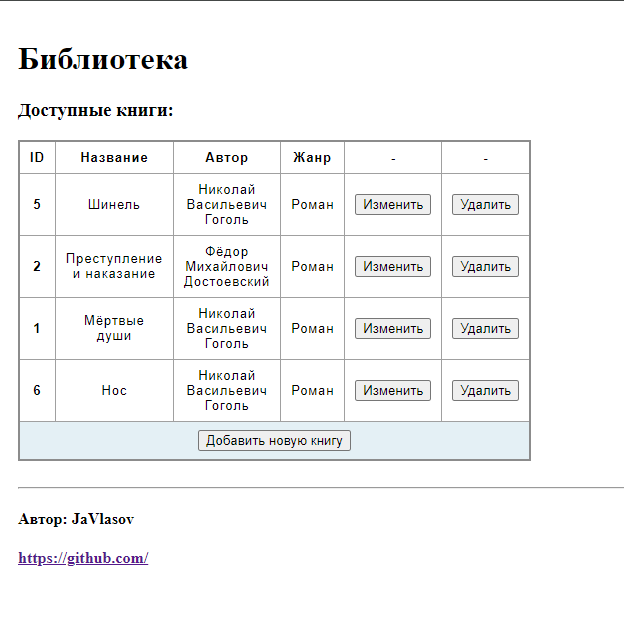

# Spring MVC with Thymeleaf

[English version bellow](#English-version)
___

# Навигация

- [Цель](#Цель)
- [Возможности приложения](#Возможности-приложения)
- [Покрытие тестами](#Покрытие-тестами)
- [База данных](#База-данных)
- [Локальный запуск](#Локальный-запуск)

## Цель:

Разрабатывать классические Web-приложения на Spring MVC;
Разрабатывать слой View на Thymeleaf.

## Возможности приложения:

Перейдя на главную страницу, можно получить список книг, которые лежат в библиотеке.
Книгу можно изменить, удалить или добавить новую.
Т.е. существуют CRUD операции только для сущности Book.

## Покрытие тестами:

Тестами покрыты все репозитории и контроллер.

[src -> test -> java -> ru -> javlasov -> springmvc](https://github.com/VlasovM/2023-11-otus-spring-vlasov/tree/master/springmvc/src/test/java/ru/javlasov/springmvc/)

## База данных

В проекте используется база Postgres sql. 
Пользователь для подключения к базе дынных: username: postgres  password: password 
Данные настройки лежат в файле **application.yaml**, поменяйте на вашего пользователя.

Для тестов используется встроенная H2 database.

## Локальный запуск

Для того, чтобы запустить проект локально вам необходимы JDK не ниже 17, система контроля версий git, сборщик проектов
maven. Клонировать проект можно через git bash:

    git clone https://github.com/VlasovM/2023-11-otus-spring-vlasov.git

Запустить класс SpringMvc и перейдите на локальный хост: http://localhost:8080

---

# English version

# Navigation

- [Goal](#Goal)
- [Application Features](#Features-applications)
- [Test coverage](#Coverage by tests)
- [Database](#Database)
- [Local Launch](#Local-launch)

## Goal:

Develop classic Web applications based on Spring MVC;
Develop a View layer on Thymeleaf.

## Features application

By going to the main page, you can get a list of books that are in the library.
The book can be changed, deleted, or a new one can be added.
That is, there are CRUD operations only for the Book entity.

## Test coverage

All repositories and the controller are covered with tests.

[src -> test -> java -> ru -> javlasov -> springmvc](https://github.com/VlasovM/2023-11-otus-spring-vlasov/tree/master/springmvc/src/test/java/ru/javlasov/springmvc/)

## Data base

The project uses a Postgres sql database.
User to connect to the melon database: username: postgres password: password
These settings are in the **application.yaml** file, change them to your user.

The built-in H2 database is used for tests.

## How to local start

In order to run a project locally, you need a JDK of at least 17, a git version control system, and a maven project
builder. You can clone a project through git bash:

    git clone https://github.com/VlasovM/2023-11-otus-spring-vlasov.git

Run the Spring Mvc class and navigate to the local host: http://localhost:8080
